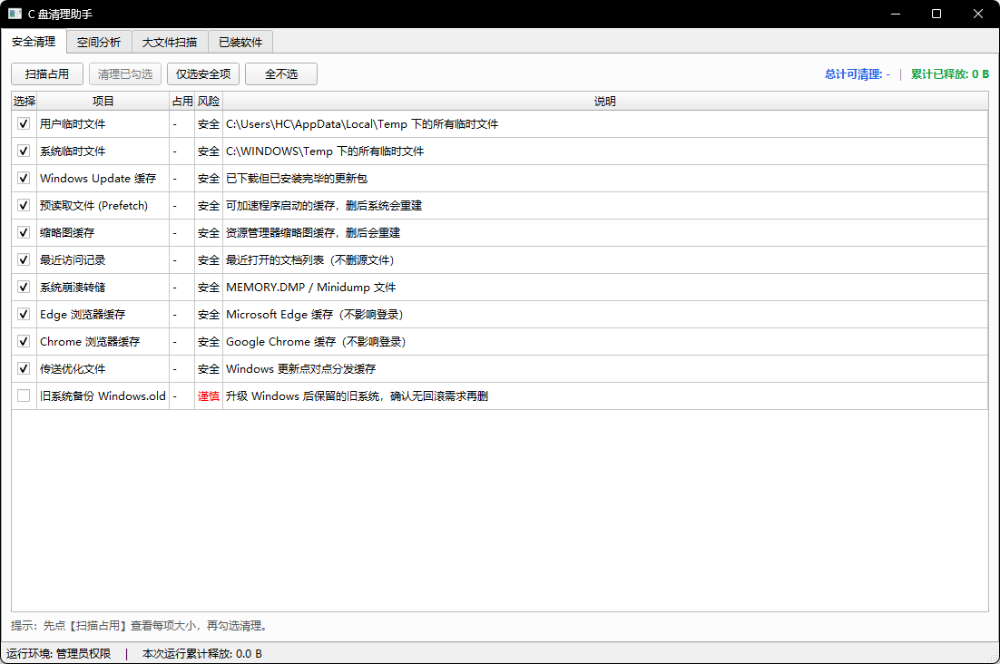
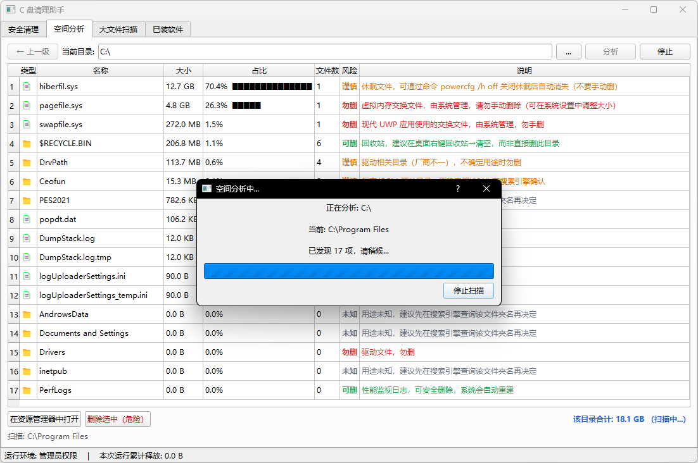
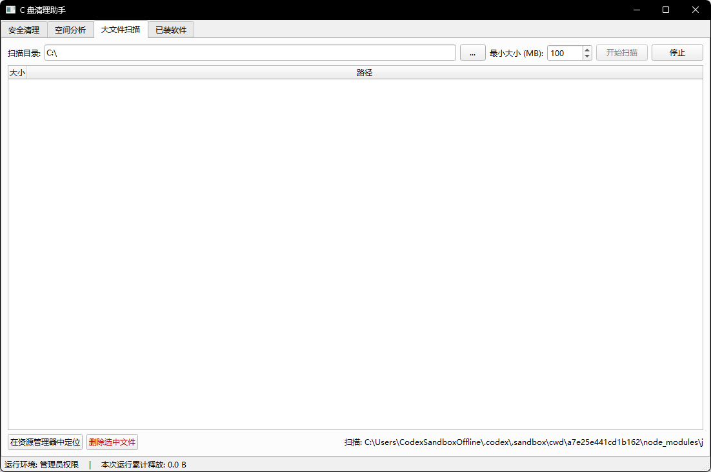
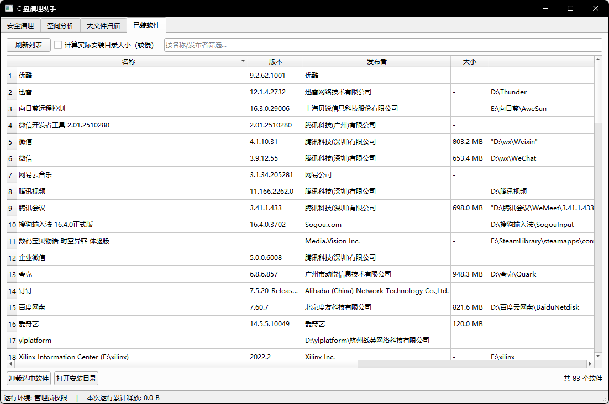

# C 盘清理助手（Disk Cleaner）

一个基于 PyQt5 的 Windows 磁盘清理辅助工具，面向普通 Windows 用户和维护人员，提供安全清理、空间分析、大文件扫描、已安装软件查看等功能。

> 当前项目处于早期维护阶段，重点目标是让磁盘空间排查更清晰、清理操作更可控，并避免误删系统关键文件。

## 功能特性

- 安全清理：扫描用户临时文件、系统临时文件、Windows Update 缓存、浏览器缓存、缩略图缓存、最近访问记录等常见可清理项。
- 空间分析：按目录统计磁盘占用，显示文件数量、占比、风险等级和处理建议。
- 大文件扫描：扫描指定目录下超过指定大小的文件，便于定位占用空间的大文件。
- 已安装软件：读取 Windows 已安装软件列表，展示名称、版本、发布者、安装路径和估算大小。
- 风险提示：对休眠文件、虚拟内存文件、系统驱动目录、Windows.old 等项目给出“安全、可删、谨慎、勿删”等提示。
- 管理员模式：打包后的程序可请求管理员权限，以便处理部分系统目录。

## 截图

### 安全清理



### 空间分析



### 大文件扫描



### 已安装软件



## 运行环境

- Windows 10 或 Windows 11
- Python 3.10+
- PyQt5

安装依赖：

```powershell
pip install -r requirements.txt
```

启动程序：

```powershell
python main.py
```

建议右键以管理员身份运行 PowerShell 或终端，否则 `C:\Windows\Temp` 等系统目录下的部分文件可能无法清理。

## 打包为 exe

双击运行：

```powershell
build_exe.bat
```

或手动执行：

```powershell
pip install -r requirements.txt
pyinstaller --noconfirm --onefile --windowed --name DiskCleaner --uac-admin main.py
```

打包完成后，可执行文件位于：

```text
dist\DiskCleaner.exe
```

## 安全说明

- 默认勾选项只包含通常可安全清理的缓存或临时文件。
- `Windows.old` 等“谨慎”项目默认不勾选，需要用户确认后再处理。
- 大文件删除前会再次确认，删除后不进入回收站，请谨慎操作。
- 已安装软件卸载功能只调用软件自身的 `UninstallString`，不强制删除安装目录。
- 系统文件、驱动目录、虚拟内存文件等会标记为高风险或勿删。

## 项目结构

```text
.
├── main.py              # PyQt5 主界面和交互逻辑
├── cleaner.py           # 安全清理项目定义和删除逻辑
├── scanner.py           # 大文件扫描逻辑
├── analyzer.py          # 空间分析逻辑
├── software.py          # 已安装软件读取逻辑
├── file_info.py         # 文件和目录风险识别
├── workers.py           # 后台任务线程
├── build_exe.bat        # Windows 打包脚本
├── DiskCleaner.spec     # PyInstaller 配置
└── requirements.txt     # Python 依赖
```

## 适合的使用场景

- C 盘空间不足，需要快速定位空间占用来源。
- 清理临时文件和常见缓存，但希望避免误删系统关键文件。
- 查看已安装软件、安装路径和占用大小。
- 为非技术用户提供一个可视化的 Windows 空间整理工具。

## 后续计划

- 补充更多 Windows 缓存目录识别规则。
- 增加扫描结果导出功能。
- 优化大目录扫描性能。
- 增加 Release 包和截图展示。
- 完善英文 README 和更多安全说明。

## 许可证

本项目使用 MIT License，详见 [LICENSE](LICENSE)。
